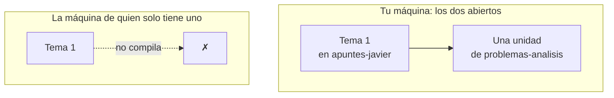

# Entre repositorios

Esta pantalla aparece **solo cuando hay más de un repositorio abierto**, y
hace tres comprobaciones que ninguna otra cosa puede hacer: `didacta check`
mira un repositorio, y desde allí el de al lado sencillamente no existe. Quien
tiene los dos delante es la aplicación.

## Los metadatos que no coinciden

Una asignatura repartida se declara en los dos `course.yaml`, y los dos tienen
que decir lo mismo.

Si uno pone «Análisis Matemático I» y el otro «Analisis Matematico I», el que
se enseña **depende de en qué orden se abrieron los repositorios**: el mismo
material se ve distinto en dos máquinas y nadie sabe cuál es el bueno.

La pantalla enseña el campo, los dos valores y de qué repositorio es cada uno.

Vale para las tres cosas que pueden declararse en dos sitios a la vez: una
asignatura, una titulación y un **bloque**.

## Las lecciones sin bloque

Cada lección dice a qué parte de la asignatura pertenece --la teoría, los
problemas, las prácticas-- y quién es cada bloque lo declara un
`taxonomy.yaml`, que puede estar en el repositorio de al lado.

Una lección que nombra un bloque que no declara **ninguno** de los abiertos no
desaparece: se ve entera, y el bloque se enseña por su id. Eso es a propósito,
y es lo que hace que abrir medio material siga funcionando. Pero casi siempre
significa una de dos cosas:

- falta abrir el repositorio que lo declara;
- alguien quitó el bloque y sus lecciones se quedaron nombrándolo.

Las dos salidas están en la pantalla: **declararlo** aquí, o **mover sus
lecciones** a un bloque que exista. Mover reescribe el `block:` de cada
`unit.yaml`, y es un solo commit por repositorio: son noventa ficheros y un
único cambio.

!!! tip "Los dos de siempre no cuentan"

    Un repositorio que todavía no declara ningún bloque tiene teoría y
    problemas igual, porque Didacta los conoce sin que nadie los escriba. En
    cuanto se declara el primero, la lista deja de ser implícita.

## Los documentos que llaman fuera

Un documento y las unidades que compone tienen que vivir en el **mismo**
repositorio. LaTeX resuelve las rutas bajo una sola raíz, así que un documento
que llama al de al lado:

- compila en la máquina que tiene los dos abiertos;
- **no compila en la de quien solo tiene uno.**

Eso no se descubre editando. Se descubre cuando otra persona va a dar la
clase.

## Nada se arregla solo

Son ficheros que pueden ser de otra persona, y propagar el valor «más nuevo»
por cuenta propia deshace el cambio de quien todavía no lo ha enviado. Se
enseña, se explica, y se pulsa.
