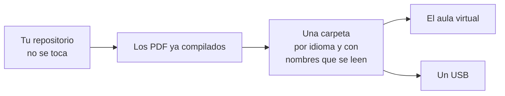

# Exportar un curso

Lo que se lleva alguien al aula virtual o a un disco: los PDF ya compilados,
en carpetas con nombres que se leen.

**El repositorio no se toca.** Lo que sale es una copia.



## Las tres decisiones

Están en la misma pantalla porque son la misma decisión:

1. **en qué idiomas**;
2. **qué temas**;
3. **qué documentos de cada tema**.

Todo viene marcado, que es lo que se quiere casi siempre, y desmarcar es más
rápido que buscar.

## Recompilar está apagado de salida

A propósito. Un curso entero son cuarenta salidas y media hora: quien acaba de
compilarlo no quiere repetirlo por exportar, y quien lo necesita lo marca.

**Lo que no esté compilado no se exporta, y se dice cuál falta.** En lugar de
salir un reparto al que le faltan tres PDF sin que nadie se entere.

## Cómo queda la carpeta

```
Análisis Matemático III 2025-2026/
├── es/
│   ├── Tema 1. Espacios normados - diapositivas.pdf
│   ├── Tema 1. Espacios normados - apuntes.pdf
│   └── Hoja 1 - problemas.pdf
└── va/
    └── …
```

Nombres largos y con espacios a propósito: esto no lo va a leer un programa,
lo va a leer alguien buscando un fichero en una lista del aula virtual.
