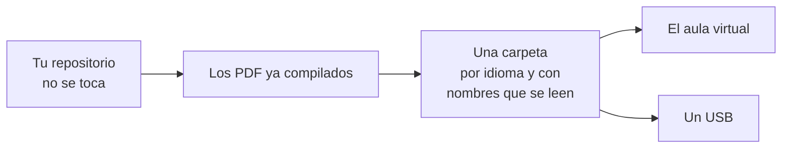

# Exportar un curso

Lo que se lleva alguien al aula virtual o a un disco: los PDF ya compilados,
en carpetas con nombres que se leen.

**El repositorio no se toca.** Lo que sale es una copia.


```mermaid
flowchart LR
  R["Tu repositorio<br/>no se toca"] --> C["Los PDF ya compilados"]
  C --> E["Una carpeta<br/>por idioma y con<br/>nombres que se leen"]
  E --> A["El aula virtual"]
  E --> U["Un USB"]
```

## Desde dónde se pide

Tres sitios, según lo que haya que llevarse:

| Lo que sale | Dónde está el botón |
| --- | --- |
| **Un curso entero** | en su fila de la pantalla de asignaturas, al lado de la estrella |
| **Un documento** | en su fila del listado del curso, si tiene algo compilado |
| **El PDF que se está mirando** | en el visor, «Guardar una copia» |

El primero pregunta qué idiomas y qué documentos; los otros dos solo preguntan
dónde, que es lo único que queda por decidir.

**Exportar no pide permiso de escritura.** Copia lo que ya está compilado y no
toca el repositorio, así que también se lleva material quien solo lo tenga para
leer.

## Las tres decisiones

Están en la misma pantalla porque son la misma decisión:

1. **en qué idiomas**;
2. **qué temas**;
3. **qué documentos de cada tema**.

Todo viene marcado, que es lo que se quiere casi siempre, y desmarcar es más
rápido que buscar.

## Solo lo del estudiante, salvo que se pida

Una carpeta exportada acaba en el aula virtual, así que **de salida solo sale
lo que puede ver un estudiante**: los enunciados y, como mucho, los
resultados. Lo demás se pide con dos casillas:

| Casilla | Lo que añade |
| --- | --- |
| **Con las resoluciones completas** | los apuntes y las hojas resueltas |
| **También las copias del profesor**, en rojo | la plantilla de corrección del examen, las diapositivas con notas |

Las copias del profesor llevan dentro las resoluciones, así que al marcar la
segunda la primera se queda marcada.

Lo que estaba compilado y se ha quedado fuera **se dice aparte** de lo que
faltaba por compilar: no es lo mismo. Al exportar un solo documento no hay
casillas; si tenía copias del profesor, el aviso lo dice y ofrece
**Incluirlas**.

Desde la terminal es `--reveal-up-to`:

```bash
didacta export am-iii@2025-2026 --to ~/Reparto                       # lo del estudiante
didacta export am-iii@2025-2026 --to ~/Reparto --reveal-up-to solutions
didacta export am-iii@2025-2026 --to ~/Corregir --reveal-up-to teacher
```

## Lo que está viejo se dice, y se recompila solo eso

Antes de preguntar nada, Didacta mira qué hay compilado. Si algún documento
tiene un PDF **desactualizado** --la lección cambió después de compilarlo-- o
**sin compilar** en los idiomas que se exportan, lo dice encima de las
casillas, con sus nombres:

> Un documento tiene algún PDF desactualizado o sin compilar: «Tema 1.
> Espacios normados».

Y la casilla **Compilar antes solo ese** viene marcada: se compila eso y lo
demás se copia tal cual. Repartir un PDF de antes de la última corrección es
justo lo que no se nota hasta que un estudiante pregunta. Solo cuenta lo que
va a salir: una copia del profesor vieja no avisa en un reparto que no la
lleva.

**Compilarlo todo antes de exportar** sigue ahí, apagado: un curso entero son
cuarenta salidas y media hora. Y lo que siga sin compilar no se exporta, y se
dice cuál falta.

## La carpeta, recordada

La carpeta se pide cada vez, pero se abre en **la última a la que se exportó
esa asignatura**: el aula virtual de cada una tiene la suya. Es de este
ordenador, así que no viaja con las preferencias sincronizadas.

## Publicar en una carpeta que se sincroniza

Con una **carpeta de reparto** elegida en Ajustes → Guardar y sincronizar, el
`⋯` de cada curso académico trae **Publicar en la carpeta de reparto**: el
mismo diálogo, sin preguntar la carpeta al final. Cada curso va a la suya,
`<carpeta de reparto>/Análisis Matemático III 2025-2026`, y OneDrive, Drive o
Nextcloud la sincronizan.

## Revisar antes de repartir

Antes de pedir la carpeta, Didacta revisa lo que se va a exportar. Si encuentra
algo --una referencia rota, una traducción desactualizada-- lo enseña, con
**Exportar igualmente** y **Cancelar**. Si no hay nada, no se ve.

## Un .zip para el aula virtual

Con **También: un .zip con todo**, además de la carpeta sale
`Análisis Matemático III 2025-2026.zip` dentro de ella, con los temas en sus
carpetas. Moodle lo descomprime en un recurso *Carpeta*: se sube un fichero en
lugar de cuarenta. Una asignatura repartida en dos repositorios sale en un
solo .zip.

Desde la terminal es `--zip`:

```bash
didacta export am-iii@2025-2026 --to ~/Reparto --zip ~/Reparto/AM3.zip
```

## Los apuntes en HTML

Con **También: los apuntes en HTML**, al lado de cada PDF que no es de
diapositivas sale una página con el mismo nombre --`Tema 1 - Apuntes.html`--,
y entra también en el .zip. Se lee con un lector de pantalla o con el texto
grande, y lleva exactamente lo que lleva su PDF: los apuntes del estudiante no
enseñan una solución ni una nota didáctica porque estén en HTML.
[:octicons-arrow-right-24: Apuntes accesibles](compilar.md#apuntes-accesibles)

Desde la terminal, `didacta export … --html`, o solo el HTML con
`didacta html am-iii@2025-2026 --to ~/Reparto/html`.

## Cómo queda la carpeta

Exportando en castellano y en valenciano:

```
Reparto/
├── es/
│   ├── Tema 1 Espacios normados/
│   │   ├── Tema 1 Espacios normados - Diapositivas.pdf
│   │   └── Tema 1 Espacios normados - Apuntes.pdf
│   └── Sin tema/
│       └── Hoja 1 - Hoja de problemas (con resultados).pdf
└── va/
    ├── Tema 1 Espais normats/
    │   └── Tema 1 Espais normats - Apunts.pdf
    └── Sense tema/
        └── …
```

- **Una carpeta por idioma**, solo si se exporta más de uno. Con uno, los temas
  van directamente en la carpeta elegida.
- **Una carpeta por tema**, con el título del tema en ese idioma. Los
  documentos que no son de ningún tema van juntos en *Sin tema* --*Sense tema*
  en valenciano--.
- **Cada PDF, «título del documento - versión»**: «Tema 1 Espacios normados -
  Apuntes.pdf». Los dos puntos del título se caen, en lugar de convertirse en
  un guion que parece una errata, y lo que Windows no admite en un nombre se
  cambia por un guion. Si dos versiones acabaran llamándose igual, la segunda
  lleva detrás el id de su plantilla en lugar de pisar a la primera.

**Los nombres van en el idioma de la carpeta**: «Apunts», «Full de problemes
(amb resultats)», «Diapositives (professor)». Sin el código de la plantilla ni
el del idioma, que ya dice la carpeta. Nombres largos y con espacios a
propósito: esto no lo va a leer un programa, lo va a leer alguien buscando un
fichero en una lista del aula virtual.

El PDF que se guarda desde el visor sale con el nombre que le pone el motor al
compilarlo, que lleva la plantilla y el idioma --«Tema 1 - notes - va.pdf»--
porque en esa carpeta están todas las versiones juntas.
