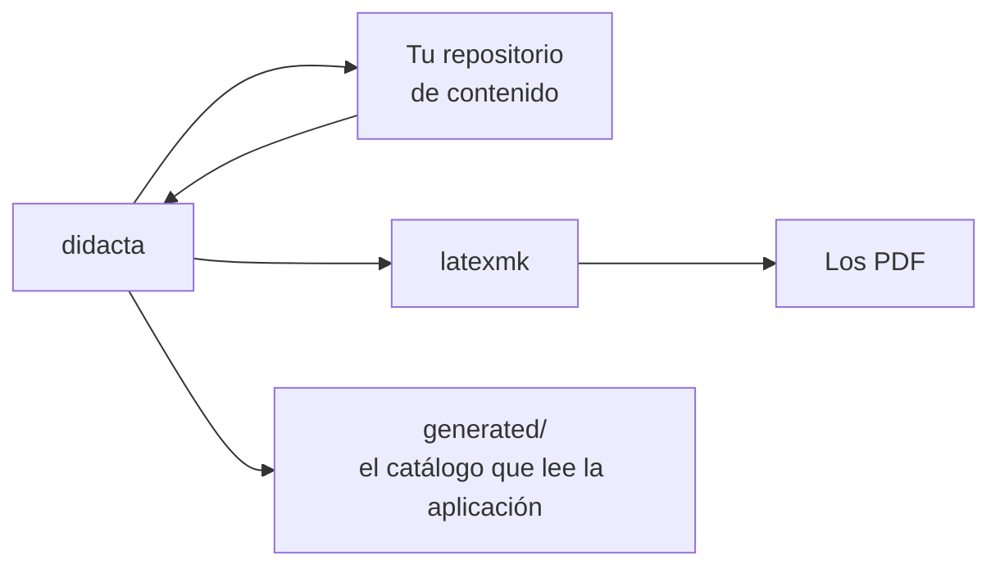

# `didacta`, en el terminal

La aplicación no reimplementa nada: llama a esta misma herramienta. Todo lo
que hace Didacta se puede hacer desde aquí, y algunas cosas **solo** se pueden
hacer desde aquí.

```bash
git clone https://github.com/franjfal/didacta.git
cd mi-repositorio-de-contenido
../didacta/cli/didacta status
```

Se ejecuta desde cualquier sitio dentro de un repositorio de contenido: la
raíz se localiza subiendo hasta encontrar `didacta.yaml`, igual que hace git
con `.git`.

!!! info "Python 3.9 y ninguna dependencia"

    No hay nada que instalar con `pip`. Es deliberado: la plataforma tiene que
    poder funcionar en un runner de integración continua sin un paso de
    instalación, y en la máquina de cualquiera sin preparar un entorno.



## Mirar

```bash
didacta status              # qué hay en este repositorio
didacta profiles            # las salidas disponibles
didacta units               # la biblioteca
didacta units --category analysis --missing va
didacta translations        # qué falta traducir, por cuánto se usa
didacta built am-iii@2025-2026   # qué hay compilado de un curso
didacta places --document am-iii@2025-2026/tema-1   # dónde más se da
```

## Comprobar

```bash
didacta check
```

Referencias que no resuelven, perfiles que no existen, documentos que compilan
en un idioma que su contenido no tiene. Es lo que conviene ejecutar antes de
dar por bueno un curso, y lo que un repositorio de contenido debería correr en
su integración continua.

## Compilar

```bash
didacta build tema-1                 # todas sus salidas
didacta build tema-1 -p slides -l va # una salida, un idioma
didacta build --all                  # el repositorio entero
didacta build --all --list           # qué haría, sin hacerlo
didacta preview analysis/normed/definition   # una unidad suelta
```

La compilación es **fuera del árbol** y con SyncTeX: el repositorio no se
llena de `.aux`, y el PDF sabe volver a la línea del fichero fuente.

## Crear

```bash
didacta new unit analysis/normed/dual-space
didacta new unit analysis/series/convergence --kind problem
didacta new year am-iii 2026-2027
didacta copy --from am-iii@2025-2026 --to am-iii@2026-2027 tema-1
```

`copy` **duplica** la composición: el curso de destino se lleva su propia
entrada y a partir de ahí los dos van por su lado. Para dar *el mismo* tema en
los dos sitios, `link`.

## Repartir

```bash
didacta export am-iii@2025-2026 --to ~/Escritorio/AM3
```

Saca los PDF ya compilados a una carpeta, en carpetas por idioma y con nombres
que se leen.

## Compartir temario entre cursos

```bash
didacta places --document am-iii@2025-2026/tema-1   # dónde se da
didacta places --unit analysis/normed/definition    # y una lección
didacta link  --from am-iii@2025-2026/tema-1 --to mat@2026-2027
didacta move  --from am-iii@2025-2026/tema-1 --to am-iii@2026-2027
didacta use   --unit analysis/normed/definition --in am-iii@2026-2027/tema-1
didacta unlink --at mat@2026-2027/tema-1
```

`link` hace que los dos cursos den **el mismo tema**: lo que se edite desde
cualquiera se ve desde el otro, porque es un solo fichero. `unlink` separa una
ubicación con una copia propia.

Dividir un grupo de varias ubicaciones a la vez:

```bash
didacta split --content d-8a41f0c27b53 \
              --group "mat@2026-2027/tema-1,doble@2026-2027/tema-1"
didacta split --unit analysis/normed/definition \
              --group "mat@2026-2027/tema-1#0"
```

Lo que no se nombre en ningún `--group` se queda con la entidad de siempre.
Con `--deep` se duplican además las lecciones que el tema lleva dentro; sin
él, que es lo corriente, el tema se separa y el material sigue siendo uno.

```bash
didacta ids            # qué lecciones no tienen id estable
didacta ids --apply    # y ponérselo
```

Escribe una línea `id:` en cada `unit.yaml` que no la tenga, derivada de la
ruta con un hash — así que sale el mismo lo haga quien lo haga, y dos personas
que pongan al día el mismo repositorio por su cuenta no crean dos identidades
para la misma lección. No mueve nada ni renombra nada.

[:octicons-arrow-right-24: Contenido vinculado](../conceptos/vinculos.md)

## Versiones congeladas

```bash
didacta freeze list   am-iii@2026-2027
didacta freeze add    am-iii@2026-2027 --name "Inicio curso 2026-27" \
                      --commit $(git rev-parse HEAD)
didacta freeze rename am-iii@2026-2027 f-3c07a9e12b64 --name "Otro nombre"
didacta freeze remove am-iii@2026-2027 f-3c07a9e12b64
```

Una congelación es **un commit con nombre**, guardado en
`courses/<asignatura>/<año>/freezes.yaml`. No copia nada y quitarla no borra
ningún commit. El SHA tiene que ser el entero.

Abrir una versión, compararla y restaurar desde ella se hacen desde la
aplicación, que es la que sabe preparar el árbol de trabajo. Lo que sí se
puede hacer aquí es traer un tema del árbol de otra versión:

```bash
didacta restore am-iii@2026-2027/tema-1 --from /ruta/al/arbol/congelado
didacta new year am-iii 2027-2028 --from-dir /ruta/al/arbol/congelado/courses/am-iii/2026-2027
```

[:octicons-arrow-right-24: Versiones congeladas](../app/congelaciones.md)

## El catálogo

```bash
didacta index
didacta index --check
```

Genera los tres JSON de `generated/` que lee la aplicación. Son **datos
derivados**: regenerarlos da los mismos bytes, y `--check` falla si están
desincronizados, que es lo que se pone en la integración continua.

## El servidor MCP

```bash
didacta mcp
```

El mismo servidor que enciende la aplicación desde Ajustes, para un cliente
que se lance a mano.

[:octicons-arrow-right-24: El servidor MCP](../app/mcp.md)

## Traer material de un sistema anterior

```bash
didacta migrate ~/Teaching ~/didacta-content
didacta migrate ~/Teaching ~/didacta-content --year 2025-2026 --apply
didacta migrate ~/Teaching ~/didacta-content --year 2025-2026 --apply --verify
```

**Sin `--apply` no escribe nada**, y en ningún caso toca el repositorio de
origen. Con `--verify` compila además cada documento migrado y lista en el
informe los que no salen, con fichero, línea y la macro culpable.

Deja un `MIGRATION-REPORT.md` con lo que no ha podido deducir: el material
antiguo no guardaba metadatos, y eso no se inventa.

## Limpiar

```bash
didacta tidy      # quita la cabecera de migración de los fuentes
didacta remove course am-iii            # cuenta lo que se llevaría
didacta remove course am-iii --apply    # y entonces lo hace
```

`remove` **sin `--apply` no borra nada**: cuenta qué se llevaría. Es la misma
cifra que enseña la aplicación antes de preguntar.
