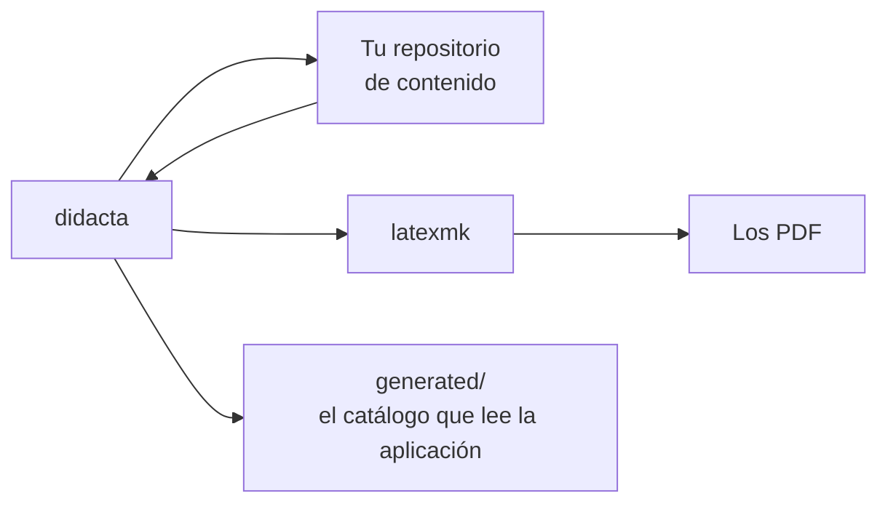

# `didacta`, en el terminal

La aplicación no reimplementa nada: llama a esta misma herramienta. Todo lo
que hace Didacta se puede hacer desde aquí, y algunas cosas **solo** se pueden
hacer desde aquí.

```bash
git clone https://github.com/franjfal/didacta.git
cd mi-repositorio-de-contenido
../didacta/cli/didacta status
```

Se ejecuta desde cualquier sitio dentro de un repositorio de contenido: la
raíz se localiza subiendo hasta encontrar `didacta.yaml`, igual que hace git
con `.git`.

!!! info "Python 3.9 y ninguna dependencia"

    No hay nada que instalar con `pip`. Es deliberado: la plataforma tiene que
    poder funcionar en un runner de integración continua sin un paso de
    instalación, y en la máquina de cualquiera sin preparar un entorno.


```mermaid
flowchart LR
  T["didacta"] --> R["Tu repositorio<br/>de contenido"]
  R --> T
  T --> L["latexmk"]
  L --> P["Los PDF"]
  T --> I["generated/<br/>el catálogo que lee la aplicación"]
```

## Mirar

```bash
didacta status              # qué hay en este repositorio
didacta profiles            # las salidas disponibles
didacta units               # la biblioteca
didacta units --category analysis --missing va
didacta translations        # qué falta traducir, por cuánto se usa
didacta built am-iii@2025-2026   # qué hay compilado de un curso
didacta places --document am-iii@2025-2026/tema-1   # dónde más se da
```

## Comprobar

```bash
didacta check
didacta check --in am-iii@2025-2026          # solo lo de ese curso
didacta check --with formulas,unused --json  # más comprobaciones, en JSON
didacta check --strict                       # los avisos también fallan
```

Referencias que no resuelven, perfiles que no existen, documentos que compilan
en un idioma que su contenido no tiene. Y lo que hay escrito: órdenes de un
solo idioma de babel en otro, entornos que no define nadie, figuras que
faltan, `\label` repetidas y `\ref` sin destino, diapositivas que se salían
en la última compilación y traducciones desactualizadas. Con `--with`, además
`formulas` (distintas entre idiomas), `unused` (lecciones sin usar),
`overfull-lines`, `decimals`, `spelling` (la ortografía, ver abajo) y
`accessible` (las figuras sin texto alternativo y lo que no deja etiquetar un
PDF). Es lo que
conviene ejecutar antes de dar por bueno un curso, y lo que un repositorio de
contenido debería correr en su integración continua, con `--strict`.

`spelling` lee la prosa de cada lección --sin las fórmulas, las órdenes ni las
etiquetas-- con [hunspell](https://hunspell.github.io/) y el diccionario de su
idioma. Didacta no los trae: se instalan una vez (`brew install hunspell` en
macOS, con los diccionarios de LibreOffice en `~/Library/Spelling`; `sudo apt
install hunspell hunspell-es hunspell-ca` en Debian o Ubuntu). El valenciano
usa `ca_ES-valencia` si está y el catalán si no. Si falta hunspell o el
diccionario de un idioma, lo dice una vez y no cuenta como aviso. Las palabras
buenas que el diccionario no conoce --«Banach», «seminorma»-- van en
`shared/palabras.txt`, una por línea, y valen para todos los idiomas. Si
hunspell está en un sitio raro, `DIDACTA_HUNSPELL` dice dónde.

Con `--json`, cada hallazgo lleva su comprobación, su gravedad y dónde está:
`path`, `line`, `unit`, `language` y, si es de uno, `document`.

## Compilar

```bash
didacta build tema-1                 # todas sus salidas
didacta build tema-1 -p slides -l va # una salida, un idioma
didacta build --all                  # el repositorio entero
didacta build --all --list           # qué haría, sin hacerlo
didacta preview analysis/normed/definition   # una unidad suelta
```

La compilación es **fuera del árbol** y con SyncTeX: el repositorio no se
llena de `.aux`, y el PDF sabe volver a la línea del fichero fuente.

Una diapositiva que se sale por abajo más de 5 pt es un **aviso** con su
lección y la línea de su `\begin{frame}` (`code: overfull-slide` en el JSON,
con `points` y `times`, en cuántas páginas). Las líneas que se salen por la
derecha fuera de las diapositivas, solo con `--overfull-lines`
(`overfull-line`), en `build` y en `preview`.

`didacta version` dice de qué versión es el motor: la etiqueta en la que
está su clon, o su commit si es una copia de desarrollo.

`didacta synctex PDF --page N --x X --y Y` dice de qué fichero y de qué
línea sale un punto de un PDF compilado (en puntos, desde arriba a la
izquierda), con la lección y el idioma si es de una. `--word` y `--text`, lo
que hay escrito ahí, afinan la línea dentro de una diapositiva.

`--accessible` saca etiquetado (PDF/UA-2, con LuaLaTeX) lo que no son
diapositivas; lo que no se deja etiquetar sale sin etiquetar y lo dice (`code:
untagged`), y el resultado de lo que sí lleva `"tagged": true`.
[:octicons-arrow-right-24: Apuntes accesibles](../app/compilar.md#apuntes-accesibles)

`--fast` compila en una sola pasada. El resultado lleva `"quick": true`, y
`didacta built` da ese PDF por viejo (`stale`, con `quick`) hasta que se
compila entero.

## Crear

```bash
didacta new unit analysis/normed/dual-space
didacta new unit analysis/series/convergence --kind problem
didacta new unit analysis/series/ratio --from analysis/series/convergence --title "Criterio del cociente"
didacta new year am-iii 2026-2027
didacta copy --from am-iii@2025-2026 --to am-iii@2026-2027 tema-1
```

`new unit --from` empieza la lección como una **copia de otra**, con su
carpeta entera y un id nuevo: son dos lecciones desde ese momento. El título
se pone en el idioma de `--lang`, o en el de referencia de la original.

Para cambiar una lección de carpeta sin copiarla:

```bash
didacta move --unit analysis/series/ratio --to analysis/criterios/ratio
```

Reescribe cada composición que la nombra por su ruta, los temas vinculados y
los prerrequisitos de las demás lecciones, y pone al día el `.tex` de cada
documento. El id no cambia, así que lo que la nombra por id sigue igual.

`copy` **duplica** la composición: el curso de destino se lleva su propia
entrada y a partir de ahí los dos van por su lado. Para dar *el mismo* tema en
los dos sitios, `link`.

## Repartir

```bash
didacta export am-iii@2025-2026 --to ~/Escritorio/AM3
```

Saca los PDF ya compilados a una carpeta, en carpetas por idioma y con nombres
que se leen. Con `--html`, al lado de cada uno que no es de diapositivas, sus
apuntes en HTML accesible; y solo el HTML, sin compilar nada:

```bash
didacta html am-iii@2025-2026 --to ~/Escritorio/AM3-html
```

### Una web del curso { #una-web-del-curso }

```bash
didacta site am-iii@2025-2026              # en site/, dentro del repositorio
didacta site am-iii@2025-2026 --to ~/web -l es -l va
```

Exporta lo que se reparte --con la misma regla que `export`: lo del
estudiante, salvo `--reveal-up-to`-- y escribe al lado un `index.html` que lo
enseña por idioma y por tema, con cada versión de cada documento enlazada. Es
una página sola, en claro y en oscuro según el sistema de quien la mire, que
se sube tal cual a GitHub Pages, a un servidor de la universidad o a una
carpeta compartida. Cada vez se rehace entera, para que lo que ya no se da no
siga enlazado; por eso solo vacía una carpeta que hizo ella.

El repositorio de ejemplo trae `.github/workflows/web-del-curso.yml`, que
publica `site/` en GitHub Pages cada vez que cambia: `didacta site`, commit y
subir.

## Compartir temario entre cursos

```bash
didacta places --document am-iii@2025-2026/tema-1   # dónde se da
didacta places --unit analysis/normed/definition    # y una lección
didacta link  --from am-iii@2025-2026/tema-1 --to mat@2026-2027
didacta move  --from am-iii@2025-2026/tema-1 --to am-iii@2026-2027
didacta use   --unit analysis/normed/definition --in am-iii@2026-2027/tema-1
didacta unlink --at mat@2026-2027/tema-1
```

`link` hace que los dos cursos den **el mismo tema**: lo que se edite desde
cualquiera se ve desde el otro, porque es un solo fichero. `unlink` separa una
ubicación con una copia propia.

Dividir un grupo de varias ubicaciones a la vez:

```bash
didacta split --content d-8a41f0c27b53 \
              --group "mat@2026-2027/tema-1,doble@2026-2027/tema-1"
didacta split --unit analysis/normed/definition \
              --group "mat@2026-2027/tema-1#0"
```

Lo que no se nombre en ningún `--group` se queda con la entidad de siempre.
Con `--deep` se duplican además las lecciones que el tema lleva dentro; sin
él, que es lo corriente, el tema se separa y el material sigue siendo uno.

```bash
didacta ids            # qué lecciones no tienen id estable
didacta ids --apply    # y ponérselo
```

Escribe una línea `id:` en cada `unit.yaml` que no la tenga, derivada de la
ruta con un hash — así que sale el mismo lo haga quien lo haga, y dos personas
que pongan al día el mismo repositorio por su cuenta no crean dos identidades
para la misma lección. No mueve nada ni renombra nada.

[:octicons-arrow-right-24: Contenido vinculado](../conceptos/vinculos.md)

## Versiones congeladas

```bash
didacta freeze list   am-iii@2026-2027
didacta freeze add    am-iii@2026-2027 --name "Inicio curso 2026-27" \
                      --commit $(git rev-parse HEAD)
didacta freeze rename am-iii@2026-2027 f-3c07a9e12b64 --name "Otro nombre"
didacta freeze remove am-iii@2026-2027 f-3c07a9e12b64
```

Una congelación es **un commit con nombre**, guardado en
`courses/<asignatura>/<año>/freezes.yaml`. No copia nada y quitarla no borra
ningún commit. El SHA tiene que ser el entero.

Abrir una versión, compararla y restaurar desde ella se hacen desde la
aplicación, que es la que sabe preparar el árbol de trabajo. Lo que sí se
puede hacer aquí es traer un tema del árbol de otra versión:

```bash
didacta restore am-iii@2026-2027/tema-1 --from /ruta/al/arbol/congelado
didacta new year am-iii 2027-2028 --from-dir /ruta/al/arbol/congelado/courses/am-iii/2026-2027
```

[:octicons-arrow-right-24: Versiones congeladas](../app/congelaciones.md)

## El catálogo

```bash
didacta index
didacta index --check
```

Genera los tres JSON de `generated/` que lee la aplicación. Son **datos
derivados**: regenerarlos da los mismos bytes, y `--check` falla si están
desincronizados, que es lo que se pone en la integración continua.

## El servidor MCP

```bash
didacta mcp
```

El mismo servidor que enciende la aplicación desde Ajustes, para un cliente
que se lance a mano.

[:octicons-arrow-right-24: El servidor MCP](../app/mcp.md)

## Traer material de un sistema anterior

```bash
didacta migrate ~/Teaching ~/didacta-content
didacta migrate ~/Teaching ~/didacta-content --year 2025-2026 --apply
didacta migrate ~/Teaching ~/didacta-content --year 2025-2026 --apply --verify
```

**Sin `--apply` no escribe nada**, y en ningún caso toca el repositorio de
origen. Con `--verify` compila además cada documento migrado y lista en el
informe los que no salen, con fichero, línea y la macro culpable.

Deja un `MIGRATION-REPORT.md` con lo que no ha podido deducir: el material
antiguo no guardaba metadatos, y eso no se inventa.

## Limpiar

```bash
didacta tidy      # quita la cabecera de migración de los fuentes
didacta remove course am-iii            # cuenta lo que se llevaría
didacta remove course am-iii --apply    # y entonces lo hace
didacta clean --size    # cuánto ocupa la carpeta de compilación
didacta clean           # y vaciarla
```

`remove` **sin `--apply` no borra nada**: cuenta qué se llevaría. Es la misma
cifra que enseña la aplicación antes de preguntar.

`didacta clean` vacía la carpeta de compilación --los PDF, los `.aux` y los
registros, que no se versionan-- y nunca nada fuera de ella; `--size` dice
cuánto ocupa sin borrar, y con documentos (`curso@año/documento`) solo
los suyos.
