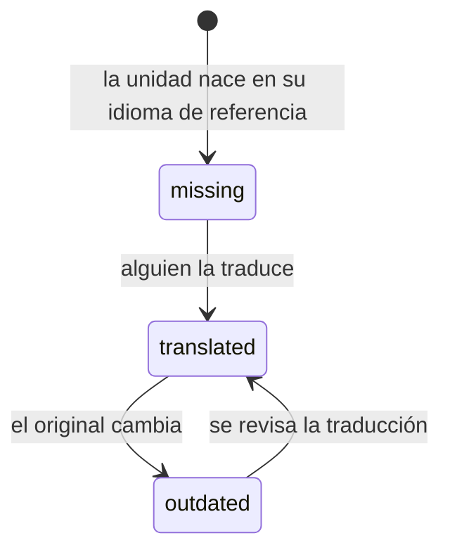

# Los idiomas

Una unidad no se traduce copiándola: **tiene un fichero por idioma dentro**.

```
content/analysis/normed/definition/
├── unit.yaml
├── es.tex      ← el original
├── va.tex      ← la traducción
└── en.tex
```

Uno de ellos es el **de referencia** (`reference: es` en `unit.yaml`): el que
se escribe primero y del que salen los demás.

## Los estados de una traducción

Didacta los calcula, no los declara nadie:

| Estado | Qué significa | Color |
|---|---|---|
| **source** | es el original | verde oscuro |
| **translated** | está traducida y al día | verde |
| **outdated** | existe, pero el original ha cambiado desde entonces | ámbar |
| **missing** | no existe ese fichero | rojo |



!!! danger "`outdated` es peor que `missing`"

    Y por eso va antes en la cola de traducción.

    Una traducción que falta se nota: el documento no compila en ese idioma, o
    sale con un aviso. Una traducción vieja **compila sin quejarse y dice algo
    que ya no es cierto**, que es exactamente el fallo que llega al alumno.

## Si falta una traducción

El documento no se cae. Se compila con el idioma de referencia en su sitio, y
**se avisa**: en la pantalla, y en el propio PDF si se pide.

Es una decisión deliberada: un tema de quince unidades con una sin traducir
tiene que poder darse. Lo que no puede pasar es que nadie se entere.

## Qué idiomas hay

Los de cada repositorio los declara su `didacta.yaml`:

```yaml
languages: [es, va, en]
default: es
```

Didacta trae los ficheros de idioma de LaTeX --nombres de entornos, cadenas
fijas, partición de palabras-- para más de los que un repositorio suele usar,
así que añadir uno es añadirlo a esa lista.

Y a qué idiomas se traduce **cada asignatura** puede ser distinto: una
optativa en inglés y el resto en castellano y valenciano es lo normal. Se dice
en `course.yaml`.

## La cola de traducción

La pantalla de **Traducción** es lo que hace que esto sea manejable en una
biblioteca de verdad.


Está ordenada por **cuántos documentos usan cada unidad**, y ése es el punto
de la pantalla. Una biblioteca de dos mil unidades tiene más huecos de los que
nadie va a cerrar nunca; una lista alfabética de lo que falta no es una cola
de trabajo, es un reproche. Ordenada por reutilización sí lo es: traducir una
unidad de la que dependen seis cursos compra seis documentos.

[:octicons-arrow-right-24: La pantalla de traducción](../app/traduccion.md)

## Traducción automática

Didacta puede llamar a un traductor automático para dar el primer paso, con
dos cuidados que no son opcionales:

**El LaTeX se protege antes de mandar nada.** Las órdenes, los entornos, las
fórmulas y las referencias se sustituyen por marcas antes de enviar el texto y
se devuelven a su sitio al recibirlo. Un traductor que se encuentre
`\begin{definition}` lo traducirá, y lo que vuelve no compila.

**La clave de API no sale del llavero.** Es configuración privada de tu
máquina, no contenido: no se guarda en ningún repositorio y no se vuelve a
enseñar después de escribirla.

Y lo que sale de ahí es un borrador. Sigue habiendo que leerlo.

[:octicons-arrow-right-24: Cómo se configura](../app/traduccion.md#traduccion-automatica)
