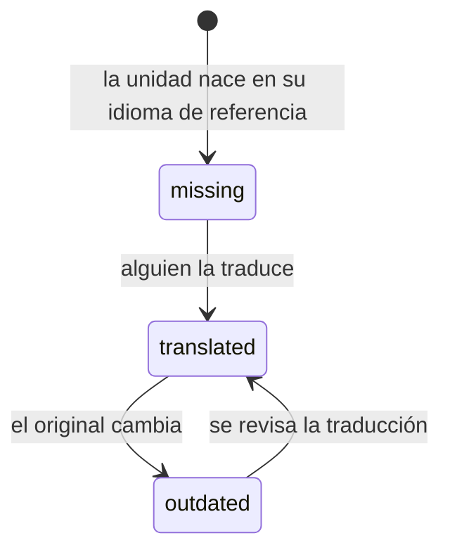

# Los idiomas

Una unidad no se traduce copiándola: **tiene un fichero por idioma dentro**.

```
content/analysis/normed/definition/
├── unit.yaml
├── es.tex      ← el original
├── va.tex      ← la traducción
└── en.tex
```

Uno de ellos es el **de referencia** (`reference: es` en `unit.yaml`): el que
se escribe primero y del que salen los demás.

## Los estados de una traducción

Didacta los calcula, no los declara nadie:

| Estado | Qué significa | Color |
|---|---|---|
| **source** | es el original | verde oscuro |
| **translated** | está traducida y al día | verde |
| **outdated** | existe, pero el original ha cambiado desde entonces | ámbar |
| **missing** | no existe ese fichero | rojo |



!!! danger "`outdated` es peor que `missing`"

    Y por eso va antes en la cola de traducción.

    Una traducción que falta se nota: el documento no compila en ese idioma, o
    sale con un aviso. Una traducción vieja **compila sin quejarse y dice algo
    que ya no es cierto**, que es exactamente el fallo que llega al alumno.

## Si falta una traducción

El documento no se cae. Se compila con el idioma de referencia en su sitio, y
**se avisa**: en la pantalla, y en el propio PDF si se pide.

Es una decisión deliberada: un tema de quince unidades con una sin traducir
tiene que poder darse. Lo que no puede pasar es que nadie se entere.

## Qué idiomas hay

Hay **cuatro listas**, y no son la misma. Confundirlas es cómo acaba una
asignatura declarada en un idioma que no tiene dónde vivir.

| | Dónde se dice | Qué significa |
|---|---|---|
| **El registro** | Didacta | a cuáles sabe **imprimir**: diez |
| **El repositorio** | `didacta.yaml` | a cuáles se **traduce aquí** |
| **La asignatura** | `course.yaml` | en cuáles se **da** |
| **Tú** | Ajustes → Idiomas | con cuáles **trabajas** |

Las tres primeras son del material: están en ficheros, se ven en el diff y las
lee todo el mundo. La cuarta es tuya, viaja con tus preferencias y no cambia
ningún fichero.

### Cada una vive dentro de la anterior

Un repositorio declara los suyos:

```yaml
# didacta.yaml
languages: [es, va, en]
default_language: es
```

Y una asignatura, los suyos **de entre esos**:

```yaml
# course.yaml
languages: [es, va]
```

Eso último es una regla, no una costumbre: una asignatura no puede darse en un
idioma que su repositorio no mantiene, porque no habría dónde poner su `.tex`.
Si lo dice, Didacta **rechaza ese `course.yaml`** — y una asignatura rechazada
no sale en la biblioteca. Por eso la ficha de una asignatura solo ofrece los
del repositorio: para añadir otro, se añade antes en Ajustes.

Con dos repositorios abiertos la cuenta es por repositorio. Una asignatura
repartida entre el de teoría --castellano y valenciano-- y el de problemas
--castellano e inglés-- se da en los tres, y cada `course.yaml` declara lo que
su repositorio puede sostener.

### Y luego estás tú

En **Ajustes → Idiomas** eliges con cuáles quieres que te ofrezca trabajar. Es
un filtro: la barra de arriba, los menús de compilar, la ficha de una
asignatura. Un repositorio que mantiene cinco y una persona que da clase en
dos no tienen por qué estorbarse.

!!! tip "Apagar no es quitar"

    Un idioma apagado sigue apareciendo donde algo **ya lo declara**: en la
    ficha de una asignatura que se da en él, en las pestañas de una unidad que
    ya tiene ese fichero. Si no, guardar se lo llevaría por delante sin que
    nadie lo hubiera pedido.

### Quitar un idioma de un repositorio

Solo se puede si ninguna asignatura se da en él. Didacta se niega y dice
cuáles lo usan; se quita antes de sus fichas, y luego del repositorio.

No es una formalidad: quitarlo con una asignatura declarada en él la haría
desaparecer de la biblioteca, y el motivo quedaría en una lista de errores que
nadie mira.

Quitarlo **no borra ningún fichero**. Los `.tex` que hubiera siguen donde
estaban; simplemente dejan de pedirse, y dejan de contar como pendientes.
Volver a añadirlo los recupera.

## La cola de traducción

La pantalla de **Traducción** es lo que hace que esto sea manejable en una
biblioteca de verdad.


Está ordenada por **cuántos documentos usan cada unidad**, y ése es el punto
de la pantalla. Una biblioteca de dos mil unidades tiene más huecos de los que
nadie va a cerrar nunca; una lista alfabética de lo que falta no es una cola
de trabajo, es un reproche. Ordenada por reutilización sí lo es: traducir una
unidad de la que dependen seis cursos compra seis documentos.

[:octicons-arrow-right-24: La pantalla de traducción](../app/traduccion.md)

## Traducción automática

Didacta puede llamar a un traductor automático para dar el primer paso, con
dos cuidados que no son opcionales:

**El LaTeX se protege antes de mandar nada.** Las órdenes, los entornos, las
fórmulas y las referencias se sustituyen por marcas antes de enviar el texto y
se devuelven a su sitio al recibirlo. Un traductor que se encuentre
`\begin{definition}` lo traducirá, y lo que vuelve no compila.

**La clave de API no sale del llavero.** Es configuración privada de tu
máquina, no contenido: no se guarda en ningún repositorio y no se vuelve a
enseñar después de escribirla.

Y lo que sale de ahí es un borrador. Sigue habiendo que leerlo.

[:octicons-arrow-right-24: Cómo se configura](../app/traduccion.md#traduccion-automatica)
