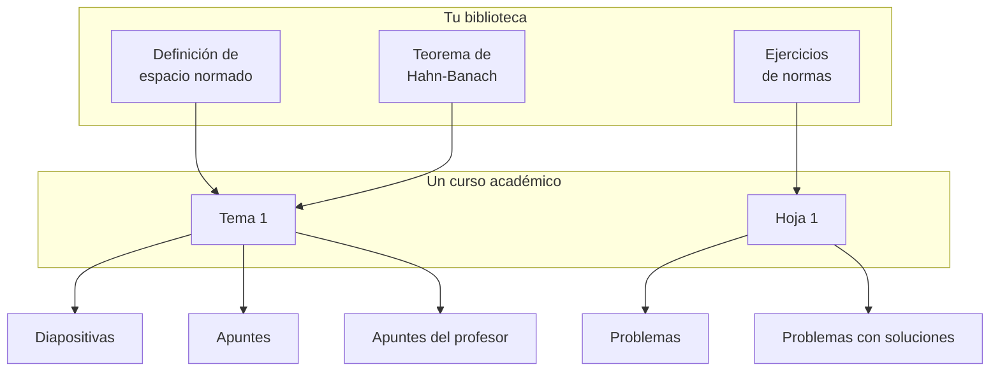

# Cómo funciona

Didacta se sostiene sobre cuatro frases. Todo lo demás --la aplicación, el
sistema LaTeX, la forma de los repositorios-- son consecuencias de éstas.

```
EL CONTENIDO SE ESCRIBE UNA VEZ.
LAS ASIGNATURAS SON COMPOSICIONES.
LOS IDIOMAS SON VARIANTES DE LA MISMA ENTIDAD.
LAS SALIDAS SE GENERAN.
```



Las mismas lecciones las usa el curso del año que viene, y la asignatura de al
lado. Nada se copia.

## El contenido se escribe una vez

Una lección es un **directorio**, no un fichero dentro de la carpeta de una
asignatura. No sabe de qué asignatura es, ni de qué año, ni si va a salir en
diapositivas o en apuntes.

Lo que hace que eso funcione es que el fichero no elige su formato: lo eligen
los interruptores. `\onlyslides{...}` solo aparece en las diapositivas,
`\onlynotes{...}` solo en los apuntes, y el entorno `teaching` solo en la
copia del profesor.

[:octicons-arrow-right-24: Qué es exactamente una unidad](unidades.md)

## Las asignaturas son composiciones

Un curso académico guarda **selección, orden y estructura**. Nunca contenido.

```yaml
documents:
  - id: tema-1
    title: {es: "Tema 1. Espacios normados"}
    profiles: [slides, notes]
    structure:
      - section: {es: Normas}
      - unit: analysis/normed/definition
      - unit: analysis/normed/banach
      # - unit: analysis/normed/dedekind   ← este año no
```

Dar el mismo tema otro año es copiar ese fichero. Repartir una unidad entre
dos asignaturas es nombrarla en las dos. Quitar algo de este curso es
comentarlo, no borrarlo: sigue existiendo, y volver a activarlo es descomentar
una línea.

[:octicons-arrow-right-24: Repositorios, cursos y documentos](repositorios.md)

## Los idiomas son variantes de la misma entidad

No hay «la unidad en castellano» y «la unidad en valenciano» como dos cosas.
Hay **una unidad** con un fichero por idioma dentro, y el idioma es el nombre
del fichero: `es.tex`, `va.tex`, `en.tex`.

De ahí sale algo que un sistema de ficheros paralelos no puede dar: Didacta
**sabe si una traducción está al día**, porque sabe cuál es el original y
cuándo cambió.

[:octicons-arrow-right-24: Los idiomas](idiomas.md)

## Las salidas se generan

Quince perfiles, del mismo origen. Un perfil no es una plantilla: es un
preajuste sobre cinco ejes independientes --medio, detalle, audiencia,
soluciones y pausas--, y añadir una salida nueva es una línea en el registro
de perfiles.

[:octicons-arrow-right-24: Las quince salidas](perfiles.md)

---

## Qué se gana, en concreto

!!! example "Una errata"

    Corriges una errata en la definición de espacio normado. La tenías en las
    diapositivas de este año, en los apuntes, en el libro de la asignatura de
    máster y en el guion de prácticas.

    Tocas **un fichero**. Los cuatro documentos salen corregidos la próxima
    vez que se compilen, y el commit dice qué cambió y cuándo.

!!! example "Un tema que vuelve"

    En 2022 diste convergencia uniforme y desde entonces no. Este año vuelve.

    No hay que buscar en qué carpeta de qué año estaba: la unidad está en la
    biblioteca, con su estado de traducción y con la lista de los cursos que
    la han usado. Se añade a la composición de este año y ya está.

!!! example "Una colección compartida"

    El departamento mantiene una colección de problemas común, y cada uno
    tiene sus apuntes.

    Son **dos repositorios**. Didacta abre los dos a la vez y los enseña
    juntos; cada cambio va al suyo. Quien no tenga acceso al de los apuntes
    ve la colección de problemas igual.
