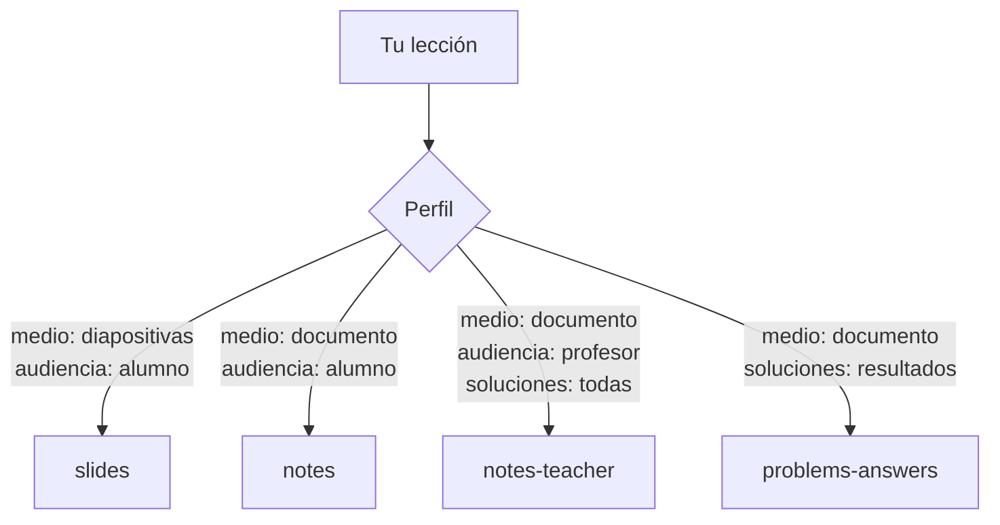
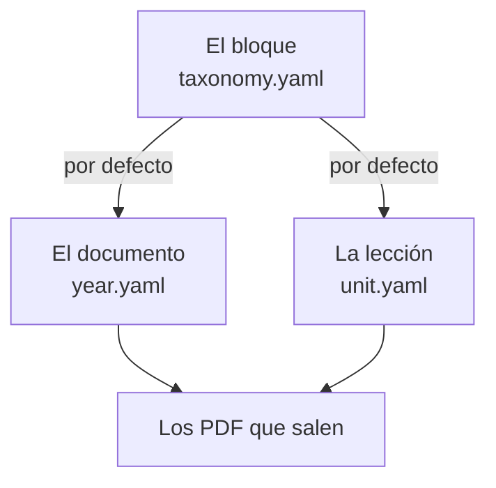

# Las quince salidas

Un **perfil** es una salida: qué PDF se produce a partir de una composición.
Se eligen al compilar, y un documento declara cuáles son los suyos.

```bash
didacta profiles
```

| id | clase | medio | soluciones | audiencia | pausas |
|---|---|---|---|---|---|
| `slides` | beamer | diapositivas | — | alumno | sí |
| `slides-flat` | beamer | diapositivas | — | alumno | no |
| `slides-teacher` | beamer | diapositivas | todas | profesor | no |
| `notes` | article | documento | — | alumno | — |
| `notes-solutions` | article | documento | todas | alumno | — |
| `notes-teacher` | article | documento | todas | profesor | — |
| `book` | book | documento | — | alumno | — |
| `handout` | article | documento | — | alumno | — |
| `handout-answers` | article | documento | resultados | alumno | — |
| `handout-teacher` | article | documento | todas | profesor | — |
| `problems` | article | documento | — | alumno | — |
| `problems-answers` | article | documento | resultados | alumno | — |
| `problems-teacher` | article | documento | todas | profesor | — |
| `exam` | article | documento | — | alumno | — |
| `exam-marking` | article | documento | todas | profesor | — |

## No son quince cosas distintas

Son cinco ejes independientes, y cada perfil es un preajuste sobre ellos:

| Eje | Qué decide | Valores |
|---|---|---|
| **medio** | si el PDF son diapositivas o un documento | `slides` · `document` |
| **clase** | la clase de LaTeX | `beamer` · `article` · `book` |
| **audiencia** | si existe el canal del profesor | `student` · `teacher` |
| **soluciones** | cuánto de un problema se revela | nada · resultados · todas |
| **pausas** | si las apariciones progresivas se respetan | sí · no |



Eso importa por una razón muy concreta: **añadir una salida nueva es una
línea**, y nada más en el sistema necesita enterarse. Ni el motor, ni la
aplicación, ni las unidades.

Esa línea estaba en `latex/didacta-profiles.tex`, que viene con Didacta -- o
sea, que añadir una salida era editar el programa. Ahora también se puede
declarar en el repositorio, y entonces se llama **plantilla**.

??? abstract "Por qué `beamerarticle` es la línea que lo sostiene"

    El problema de fondo es que `\begin{frame}` es de beamer y no existe en
    `article`. Sin resolverlo, un fichero que sirva para las dos cosas tendría
    que estar lleno de condicionales, que es exactamente lo que se quería
    evitar.

    `beamerarticle` es el paquete de beamer que define su vocabulario --
    `frame`, `\pause`, los overlays-- dentro de una clase normal. Así el mismo
    `\begin{frame}` produce una diapositiva con `beamer` y un bloque de texto
    con `article`, sin que el contenido diga nada.

    Está contado entero en la [arquitectura](../proyecto/arquitectura.md).

## Las pausas

`slides` respeta `\pause` y las apariciones progresivas; `slides-flat` no.

Las dos hacen falta y no son la misma cosa: las de clase se proyectan y las
apariciones ayudan; las que se suben al aula virtual se imprimen, y una
diapositiva con cuatro apariciones se convierte allí en cuatro páginas casi
iguales.

## Las copias del profesor

Los perfiles `-teacher` abren un canal que en los demás **no existe**:

- lo que esté en un entorno `teaching` --ritmo, avisos, por dónde se atascan--;
- lo que esté en `\onlyteacher{...}`;
- todas las soluciones de todos los problemas;
- y en `exam-marking`, además, los criterios de corrección.

Que no exista, y no que esté oculto, es la diferencia importante: no hay
ninguna forma de que un descuido reparta la copia del profesor con el texto
dentro pero invisible.

## Las plantillas: tus propias salidas

Una plantilla es un perfil declarado por quien escribe el material, con una
cosa más: **su propio preámbulo de LaTeX**. Vive en el repositorio:

```
templates.yaml          las declaraciones
templates/<id>.tex      la cabecera de cada una, opcional
```

```yaml
templates:
  - id: apuntes-a5
    title:
      es: Apuntes de bolsillo
    class: article
    options: "10pt,a5paper"
    axes: {medium: document, detail: full}
```

Y `templates/apuntes-a5.tex`, si hace falta:

```latex
\usepackage{lmodern}
\geometry{margin=1.5cm}
```

Ese fichero se lee **al final del preámbulo de Didacta**, y ese orden es la
razón de que exista: una plantilla puede redefinir lo que Didacta acaba de
definir --los márgenes, los colores, un entorno-- en lugar de que Didacta la
pise.

### Cuatro reglas, y ninguna puede romper nada

**Un repositorio que no declara ninguna compila igual que siempre.** Las
quince de arriba siguen viniendo con el programa. Sin `templates.yaml` no
cambia absolutamente nada.

**Una plantilla con el id de una de serie la sustituye.** Editar «Apuntes» es
declarar una plantilla que se llama `notes`. La de serie sigue en el programa,
que es lo que mantiene vivo un `pdflatex master.tex` a mano, en un editor y
sin que el motor intervenga.

**`active: false` la apaga sin borrarla.** Deja de compilarse y se queda
declarada, con su cabecera, para el curso que vuelva a hacer falta. Borrarla
perdería justamente lo que se quería guardar.

**Se declara en un repositorio y la usan todos.** Como los bloques y las
titulaciones: la teoría y los problemas están repartidos en dos repositorios y
el bloque de uno puede compilarse con la plantilla que declara el otro.

## Qué se compila de cada cosa

Tres niveles, y cada uno se aparta del anterior solo si quiere:



**El bloque** dice con qué se compila lo suyo:

```yaml
blocks:
  - id: theory
    title: {es: Teoría}
    templates: [slides, notes, book]
```

**El documento** y **la lección** pueden quedarse con menos:

```yaml
# en year.yaml
documents:
  - id: tema-1
    templates: [notes]

# en unit.yaml
templates: [slides]
```

Una lista **vacía o ausente quiere decir «lo que toque»**, nunca «nada»: sin
lista, el bloque compila en todas las plantillas activas, y el documento y la
lección en las de su bloque. Si significara «nada», declarar un bloque dejaría
su material sin salidas y el botón de compilar no haría nada sin decir por
qué.

Un documento no declara bloque: hereda el de las lecciones que compone, así
que un tema con su teoría y sus ejercicios sale con las plantillas de los dos.

!!! info "El nombre viejo se sigue leyendo"

    En `year.yaml` esto se llamaba `profiles:` y está escrito en cientos de
    entradas. Se lee igual; lo que Didacta escribe es `templates:`.

## Qué perfiles tiene un documento

Se declaran en `year.yaml`:

```yaml
documents:
  - id: tema-1
    profiles: [slides, slides-flat, notes, notes-teacher]
```

Si no se dice nada, el motor usa los que correspondan al tipo del documento:
un `kind: problems` sale en los tres de problemas, un `kind: theory` en
diapositivas y apuntes.

En la aplicación, la pantalla del documento lista lo que se compilaría y
permite elegir. Desde el terminal:

```bash
didacta build tema-1                 # todos los suyos
didacta build tema-1 -p slides -l va # uno, en un idioma
didacta build --all --list           # qué haría, sin hacerlo
```
