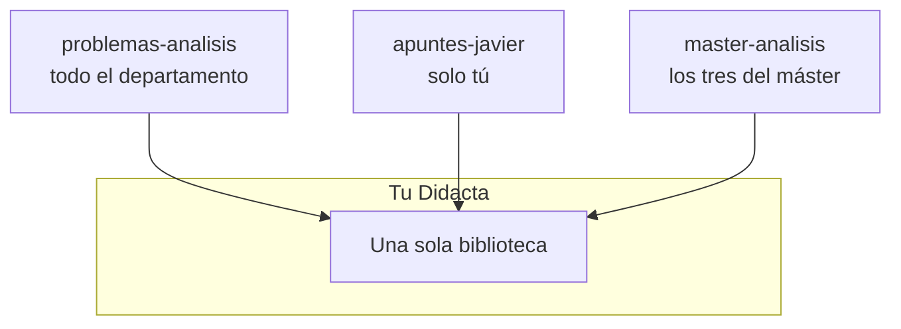

# Repositorios de contenido

Un repositorio de contenido es un repositorio de git corriente con una forma
concreta dentro.

```
<repositorio>/
├── didacta.yaml                       ajustes del repositorio
├── content/<área>/<tema>/<unidad>/
│   ├── unit.yaml                      título, etiquetas, idiomas, estado
│   ├── es.tex  va.tex  en.tex         el mismo contenido, un fichero por idioma
│   └── figures/                       sus imágenes
├── problems/<área>/<tema>/<unidad>/
│   ├── unit.yaml
│   └── es.tex  va.tex  en.tex         enunciado + resultado + solución + corrección
├── courses/<asignatura>/
│   ├── course.yaml                    lo que no cambia entre cursos
│   └── <curso>/
│       ├── year.yaml                  selección, orden, estructura
│       └── <documento>.tex            la composición
└── generated/                         el catálogo que lee la aplicación
```

Se trabaja desde cualquier sitio dentro del repositorio: la raíz se localiza
subiendo hasta encontrar `didacta.yaml`, igual que hace git con `.git`.

## Las tres carpetas

`content/`
:   La teoría. Definiciones, teoremas, ejemplos, demostraciones.

`problems/`
:   Los ejercicios. La misma forma que una unidad de teoría, pero con los
    [cuatro campos de un problema](problemas.md).

`courses/`
:   Las composiciones. **Aquí no hay materia**: cada línea es una referencia a
    algo de `content/` o de `problems/`.

## `didacta.yaml`

```yaml
name: Apuntes de análisis
languages: [es, va, en]
default: es

institution: Universitat de València
```

## Un curso académico

```yaml
# courses/am-iii/2025-2026/year.yaml
course: am-iii
year: 2025-2026
group: A
language: es

documents:
  - id: tema-1
    kind: theory
    title:
      es: Tema 1. Espacios normados
    profiles: [slides, notes]
    structure:
      - section:
          es: Normas
      - unit: analysis/normed/definition
      - unit: analysis/normed/banach
      # - unit: analysis/normed/dedekind
```

!!! tip "Las líneas comentadas son un estado, no basura"

    `# - unit: …` es material que existe y que **este año no se da**. Volver a
    activarlo es quitar una almohadilla, y ésa es la edición más común al
    preparar un curso.

    Por eso Didacta edita estos ficheros **sin pasarlos por un parser de
    YAML**: un round trip se llevaría por delante los comentarios --y con
    ellos la lista de lo que quedó fuera-- en silencio y en la primera
    edición. Cuando no reconoce una forma, se niega y ofrece el editor de
    texto, en lugar de adivinar.

## Duplicar un curso

```bash
didacta new year am-iii 2026-2027
```

Copia el fichero de estructura. Las unidades no se tocan: lo que se duplica es
la selección y el orden.

## Varios repositorios

Didacta abre **todos los que le digas a la vez**, cada uno con su color, y los
enseña como una sola biblioteca. Cada cambio va al repositorio del que salió
el fichero.



Eso permite repartir el material según quién debe verlo, que es lo que en la
práctica hace falta:

| Repositorio | Quién entra | Qué lleva |
|---|---|---|
| `problemas-analisis` | todo el departamento | la colección de problemas común |
| `apuntes-javier` | solo su autor | sus apuntes de teoría |
| `master-analisis` | los tres que dan el máster | una asignatura compartida |

**Quién ve qué lo decide GitHub**, con los permisos que ya tiene.

### Lo que hay que saber si se reparte una asignatura

Dos cosas solo pueden ir mal con más de un repositorio abierto, y las dos las
comprueba Didacta:

**Los metadatos que discrepan.** Una asignatura repartida se declara en los
dos `course.yaml`, y los dos tienen que decir lo mismo. Si uno pone «Análisis
Matemático I» y el otro «Analisis Matematico I», el que se enseña depende de
en qué orden se abrieron los repositorios.

**Los documentos que llaman fuera de su repositorio.** Un documento y las
unidades que compone tienen que vivir en el mismo: LaTeX resuelve las rutas
bajo una sola raíz, así que un documento que llama al de al lado compila en la
máquina que tiene los dos abiertos y no compila en la de quien solo tiene uno.
Eso no se descubre editando; se descubre cuando otra persona va a dar la
clase.

[:octicons-arrow-right-24: La pantalla «Entre repos»](../app/entre-repos.md)

## El catálogo

`generated/` lleva tres JSON con todo lo que la aplicación necesita para
enseñar la biblioteca sin abrir dos mil ficheros. Lo escribe el motor:

```bash
didacta index
didacta index --check    # falla si están desincronizados, para CI
```

Son **datos derivados**: regenerarlos da los mismos bytes. La aplicación de
escritorio los regenera sola cuando detecta que se han quedado viejos.

Para la biblioteca entera de 2147 unidades pesan 77 kB comprimidos, que es lo
que permite publicarlos en una página estática sin ningún servidor detrás.
