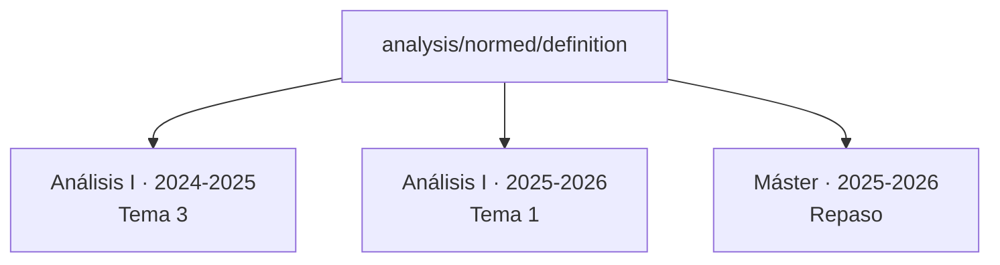

# Microlecciones

La pieza de Didacta es la **unidad**: un trozo de materia lo bastante pequeño
para que se pueda reutilizar y lo bastante grande para que signifique algo.
Una definición con su ejemplo. Un teorema con su demostración. Un problema.

## Una unidad es un directorio

```
content/analysis/normed/definition/
├── unit.yaml          título, etiquetas, idiomas, estado
├── es.tex             el contenido, en castellano
├── va.tex             el mismo contenido, en valenciano
└── figures/
    └── bola-unidad.pdf
```

Que sea un directorio y no un fichero es lo que hace que **sus idiomas, sus
metadatos y sus figuras se muevan juntos**. Reclasificar una unidad --moverla
de `analysis/normed` a `analysis/banach`-- es mover una carpeta, y no hay
ninguna forma de dejarse la mitad detrás.

## El idioma es el nombre del fichero

`va.tex`, y no `03VAL-espacios-normados.tex`.

Eso no es cosmética. El ordinal que antes llevaba el orden vive ahora en la
composición, que es donde el orden pertenece: **reordenar un tema ya no
implica renombrar ficheros**. Y el código de idioma en un sitio fijo es lo que
permite que la aplicación conozca el estado de traducción de dos mil unidades
sin que nadie lo declare.

## El fichero de contenido

```latex
\begin{frame}
\didactatitle{Definición de espacio normado}

La métrica usual en $\mathbb{R}$ es $d(x,y) = |x-y|$.

\onlynotes{%
  La idea es quedarse con las propiedades de esa distancia que sirven
  para algo y olvidarse del resto.
}

\begin{definition}[Espacio normado]
Un par $(E, \|\cdot\|)$ donde $E$ es un espacio vectorial y
$\|\cdot\| : E \to \mathbb{R}$ cumple\ldots
\end{definition}

\begin{teaching}[Ritmo]
Quince minutos. Detente en la homogeneidad: es donde se atascan.
\end{teaching}
\end{frame}
```

Tres cosas de aquí que merecen atención:

**`\begin{frame}` no significa «diapositiva».** Es la unidad de contenido. En
un perfil de diapositivas sale como una diapositiva; en uno de apuntes, como
un bloque de texto seguido. Lo que sostiene ese truco es `beamerarticle`.

**`\onlynotes` es el mecanismo entero.** Hay tres canales --diapositivas,
apuntes y profesor-- y cada trozo dice a cuáles pertenece. Lo que no dice
nada, sale en todos.

**`teaching` es para ti.** Nunca sale en un documento del alumno, en ningún
perfil y por ningún descuido, porque el perfil es quien decide si ese canal
existe.

[:octicons-arrow-right-24: Todo lo que se puede escribir](../escribir/referencia.md)

## Los metadatos

```yaml
id: analysis.normed.definition
kind: theory

title:
  es: Espacios normados
  va: Espais normats

category: analysis
topic: normed
tags: [norma, banach]

reference: es          # de qué idioma salen los demás

languages:
  es: {status: source}
  va: {status: translated, indent: false}

prerequisites: [analysis/metric/distance]
objectives:
  - Reconocer una norma
  - Distinguir norma de métrica
duration_minutes: 15
```

Casi todo es opcional. `title` y `kind` se usan en toda la aplicación;
`prerequisites` y `objectives` son para quien los quiera.

!!! info "`status` se calcula, no se declara"

    Que una traducción esté al día no lo dice nadie escribiéndolo: se deduce
    comparando cuándo cambió el original con cuándo cambió la traducción. Una
    marca escrita a mano diría que sí el día que se escribió y seguiría
    diciéndolo cinco revisiones después.

!!! tip "`indent: false`, y cuándo hace falta"

    Al guardar un `.tex` desde la aplicación se le ordena la sangría --con
    `latexindent` si está instalado, y si no con el indentador propio, que
    hace menos y siempre funciona--. Eso cambia **solo** el espacio del
    principio de cada línea, nunca lo de dentro de un `verbatim`.

    Un fichero escrito antes de que esto existiera se queda como está hasta
    que alguien lo guarde. Para ordenarlo sin tocarlo hay un botón
    **«Sangrar»** en la barra de formato del editor: deja el cambio sin
    guardar, para poder mirarlo.

    Aun así hay ficheros que hay que dejar quietos, y por eso se puede apagar
    desde la casilla de la barra del editor, en cada idioma por separado:

    - Un entorno de código **propio**, que el indentador no conoce y por tanto
      no protege. Ahí el espacio en blanco es el contenido: reindentarlo
      cambia lo que sale impreso sin tocar una letra.
    - Un `.tex` **generado** por otra herramienta y que se vuelve a generar:
      sangrarlo convierte cada regeneración en un diff contra todo el fichero,
      y el historial deja de servir para ver qué cambió de verdad.
    - Un fichero con un `\\begin` **sin cerrar** --material recién migrado lo
      tiene--. LaTeX lo compila igual porque es indulgente; el contador de
      niveles no lo es, y a partir de ahí sale todo corrido.

    Es por idioma porque el motivo vive en un fichero concreto: que el
    castellano venga generado no dice nada del inglés escrito a mano.

## La misma lección, en varios sitios



Corriges una errata en la unidad y queda corregida en los tres. No hay tres
copias que sincronizar, porque no hay tres copias.

## Dos preguntas que la biblioteca contesta y el repositorio no

Estas dos exigen recorrer **todas las composiciones a la vez**, así que un
`grep` no las contesta:

**¿Dónde se usa esta unidad?** Que es la forma práctica de «¿puedo cambiar
esto?». Sale en el panel de cada unidad, con el curso, el año y el documento.

**¿Qué unidades no usa nadie?** Material que existe y no se está dando. Después
de migrar un sistema anterior, eso es una lista larga y muy útil.

## Cómo se crea una unidad

Desde el terminal:

```bash
didacta new unit analysis/normed/dual-space
didacta new unit analysis/series/convergence --kind problem
```

Crea el directorio, el `unit.yaml` con los campos puestos y el fichero del
idioma de referencia.
