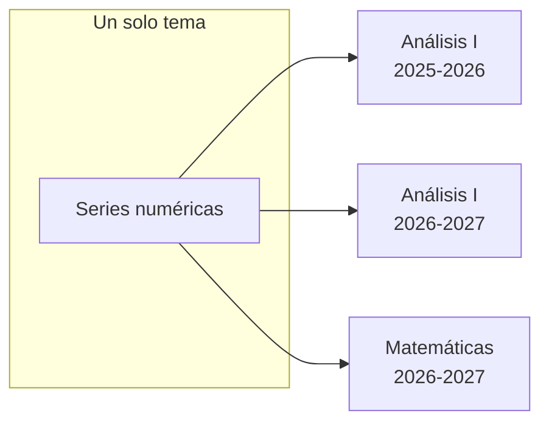

# Contenido vinculado

Un tema se da un año, y al siguiente otra vez. La misma lección entra en
Análisis I y en el doble grado. Una hoja de problemas del departamento la usan
cuatro personas.

La respuesta fácil es copiar, y la respuesta fácil siempre acaba igual: cuatro
copias que divergen, una errata corregida en tres de ellas, y nadie que sepa
cuál es la buena.

Didacta no copia. Lo que hace es **distinguir qué es una cosa de dónde
aparece**.

```
CONTENIDO   qué es           una lección, un tema
UBICACIÓN   dónde aparece    en este curso, en esta asignatura, en esta posición
```

Varias ubicaciones pueden apuntar al mismo contenido. Editarlo desde
cualquiera de ellas lo cambia en todas — **no porque algo se propague, sino
porque es el mismo fichero**.



## La mitad ya era así

Conviene decirlo, porque explica por qué esto no cambia nada de lo que ya
funcionaba: **una lección nunca fue una copia**. Esta línea de la composición
de un curso

```yaml
- unit: analisis/series/convergencia
```

no guarda contenido: nombra una lección que vive una sola vez en `content/`.
Los treinta cursos que la llaman llaman a la misma, y por eso corregir una
errata siempre ha sido corregirla una vez.

Lo que faltaba eran tres cosas:

- poder **decirlo desde la aplicación**, en lugar de editar el `year.yaml`;
- que un **tema entero** —con su título, su orden y sus apartados— se pudiera
  compartir igual, porque copiarlo sí duplicaba;
- que la identidad no dependiera de **la ruta**, que es lo que se rompe el día
  que alguien reorganiza `content/`.

## Un id que no es la ruta

Cada lección declara un identificador propio en su `unit.yaml`:

```yaml
id: u-6f3a2c91d4e7
```

La ruta sigue siendo la dirección —es lo que escribe `\DidactaUnit` y lo que
lee LaTeX—, pero **la identidad es el id**. Mover la carpeta ya no rompe quién
la usa, y «este material, ¿dónde más está?» sigue teniendo respuesta después
de reorganizar la biblioteca.

Los ids son opacos a propósito. Uno legible es uno que alguien acaba editando
para que «se entienda mejor», y ese día dos entidades distintas comparten
identidad.

!!! info "Un repositorio de antes no se rompe"

    Sin `id:` declarado, Didacta lo deduce de la ruta como ha hecho siempre.
    Ponerlos al día es una operación explícita, con su propio commit, que no
    mueve ni renombra nada.

    [:octicons-arrow-right-24: Poner los ids](../app/ajustes.md#poner-los-ids-a-las-lecciones)

## Un tema compartido

Cuando un tema se da en más de un sitio, su contenido se muda a la raíz del
repositorio y cada curso se queda con la ubicación:

```yaml title="shared/documents/d-8a41f0c27b53.yaml"
id: d-8a41f0c27b53
kind: theory
title:
  es: "Tema 4: series numéricas"
structure:
  - unit: analisis/series/convergencia
  - unit: analisis/series/criterios
```

```yaml title="courses/analisis/2026-2027/year.yaml"
documents:
  - id: series
    link: d-8a41f0c27b53
```

El `id` local se conserva porque es el nombre del `.tex` que compila y el de la
carpeta de salida: cada curso tiene su portada y su año. El cuerpo sale de un
solo sitio.

Un tema que **solo se da en un curso no cambia nada**: se queda escrito donde
estaba, exactamente como hasta ahora. Compartir no es obligatorio para escribir
un curso.

## El grupo de sincronización no se guarda { #grupo-de-sincronizacion }

Esto es lo que hace que el modelo se sostenga, y merece una frase propia:
**no hay ninguna tabla de vínculos en ninguna parte**. El grupo es el conjunto
de ubicaciones que nombran el mismo id, y se calcula leyendo los ficheros.

Una tabla aparte sería una segunda fuente de verdad que puede contradecir a
los ficheros, y reconciliar las dos después de un `git merge` es exactamente
el problema que esto existe para no tener.

De ahí salen dos propiedades que se notan:

- **un clon limpio lo reconstruye todo**, porque los vínculos *son* los
  ficheros;
- **da igual quién lo haya hecho.** Si alguien vincula un tema desde otro
  ordenador, desde el terminal o editando el YAML a mano, un `pull` lo trae y
  Didacta lo ve igual.

## Las cuatro operaciones

Son cuatro cosas distintas y la aplicación las ofrece por separado, porque
confundirlas es cómo se pierde material: alguien cree que está copiando y está
compartiendo, o al revés.

| | Qué hace con el contenido | Qué hace con las ubicaciones |
|---|---|---|
| **Mover** | nada | quita una y pone otra |
| **Añadir vinculado** | nada | añade una |
| **Duplicar** | crea uno nuevo, con id propio | la nueva apunta al nuevo |
| **Dividir vinculación** | clona el contenido para un subconjunto | las reparte entre los dos |

Por dentro son la misma pieza vista desde cuatro sitios —duplicar es dividir
con un grupo de uno— y están escritas así a propósito: una sola manera de
clonar una entidad, y cuatro nombres arriba porque lo que se quiere hacer es
distinto en cada caso.

## Dividir

El caso que llega tarde y siempre llega: dos asignaturas compartían el tema y
este año dejan de hacerlo.

!!! example "Un tema que se separa"

    `Análisis 2025-26`, `Análisis 2026-27`, `Matemáticas 2026-27` y
    `Doble Grado 2026-27` dan el mismo tema.

    Se reparten en dos grupos: los dos de Análisis por un lado, Matemáticas y
    el doble grado por otro.

    Al confirmar, los dos de Análisis conservan la entidad de siempre; los
    otros dos reciben una copia con identidad propia, con el contenido tal
    como está hoy. **Dentro de cada grupo siguen sincronizados**; entre grupos,
    ya no.

Un grupo que se queda con **una sola** ubicación deja de ser un grupo: su
contenido vuelve a estar escrito en su curso. Un fichero compartido que no
comparte con nadie es una indirección que solo estorba.

### Qué pasa con las lecciones de dentro

Separar dos temas casi nunca quiere decir separar las cuarenta lecciones que
llevan dentro. Por eso, por defecto, **no se duplican**: el tema se separa y
el material sigue siendo uno, que es justo lo que hace útil tener una
biblioteca.

Quien quiera la rama entera independiente lo marca al dividir, y entonces sí
se clona cada lección. Está apagado por defecto porque generar cuarenta
identidades que nadie pidió no se deshace con un botón.

[:octicons-arrow-right-24: Cómo se hace, en la aplicación](../app/vinculos.md)

## Y todo esto vive en git

Los ids, los ficheros compartidos y las ubicaciones son **ficheros de texto
versionados**. Eso no es un detalle de implementación: es lo que hace que un
`clone` en otro ordenador vea los mismos vínculos, que un `pull` traiga los
que hizo otra persona, y que una [versión congelada](../app/congelaciones.md)
enseñe los que había aquel día.

[:octicons-arrow-right-24: Las versiones congeladas](../app/congelaciones.md)
