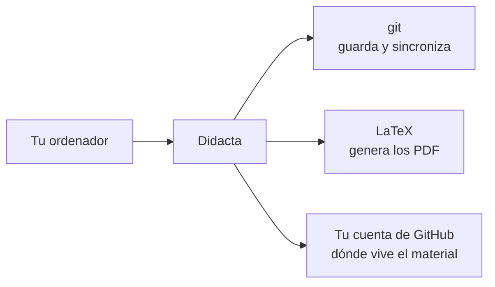

# Instalar Didacta

Didacta es una aplicación de escritorio para macOS, Windows y Linux. No hay
versión web que sirva para trabajar: escribir necesita guardar una credencial
de GitHub en un sitio seguro, y un navegador no tiene ninguno.

--8<-- "descargas.md"



## Qué más hace falta en la máquina

Didacta no lleva dentro ni LaTeX ni git, y es deliberado. Lo que hace es
buscarlos y decir dónde ha mirado cuando no los encuentra.

<div class="grid cards" markdown>

-   :material-console: __git__

    ---

    Para clonar los repositorios, guardar los cambios y enviarlos.

    En macOS viene con las herramientas de línea de órdenes de Xcode
    (`xcode-select --install`); en Linux está en cualquier distribución; en
    Windows se descarga de [git-scm.com](https://git-scm.com/).

-   :material-format-text: __Una distribución de TeX__

    ---

    Para compilar los PDF. TeX Live 2023 o posterior, con `latexmk`.

    [:octicons-arrow-right-24: Cuál instalar](latex.md)

-   :material-language-python: __Python 3.9 o posterior__

    ---

    El motor que compila está escrito en Python y **no tiene ninguna
    dependencia**: no hay nada que instalar con `pip`.

    macOS y Linux ya lo traen.

-   :material-github: __Una cuenta de GitHub__

    ---

    El material vive en repositorios de GitHub, y quién puede leer o escribir
    en cada uno lo dice GitHub. Didacta no mantiene ninguna otra lista.

    [:octicons-arrow-right-24: Entrar y abrir el primer repositorio](primer-repositorio.md)

</div>

!!! note "Compilar desde la aplicación, hoy"

    El botón de compilar funciona en **macOS y en Linux**. En Windows la
    aplicación hace todo lo demás --biblioteca, edición, traducción,
    composición, historial-- pero los PDF hay que sacarlos desde el terminal
    con `python cli\didacta build …`.

## Instalar, sistema por sistema

=== ":material-apple: macOS"

    1. Abre el `.dmg` y arrastra **Didacta** a la carpeta Aplicaciones.
    2. La primera vez, ábrela con el botón derecho → **Abrir**.

    Ese segundo paso es por Gatekeeper: Didacta todavía no está firmada con un
    certificado de Apple Developer ID, así que macOS avisa de que no puede
    comprobar quién la hizo. Lo que **no** hay que hacer es desactivar
    Gatekeeper ni quitar la cuarentena a mano; con abrir una vez desde el menú
    contextual basta, y a partir de ahí se abre normal.

    Se instala en `/Aplicaciones` o en `~/Aplicaciones`, y las dos valen. Si
    está en `/Aplicaciones` con una cuenta que no es administradora, Didacta
    avisará de que no puede actualizarse sola **antes** de descargar nada.

=== ":material-microsoft-windows: Windows"

    1. Ejecuta el instalador.
    2. Si SmartScreen avisa: **Más información** → **Ejecutar de todas
       formas**.

    Se instala **para tu usuario**, en `%LOCALAPPDATA%\Programs\Didacta`, así
    que no pide contraseña de administrador ni la necesita para actualizarse.

    El aviso de SmartScreen es el mismo caso que el de macOS: falta el
    certificado de firma de código. Puedes comprobar que el fichero es el que
    debe ser con su SHA-256, que está más arriba.

=== ":material-linux: Linux"

    ```bash
    chmod +x Didacta-*.AppImage
    ./Didacta-*.AppImage
    ```

    Un AppImage es un solo fichero: no instala nada, no toca el gestor de
    paquetes y se borra borrándolo. Ponlo donde quieras tenerlo --
    `~/Aplicaciones` o `~/.local/bin`-- porque **ahí es donde se actualizará
    solo**, sustituyendo ese mismo fichero.

    Necesita `libsecret` para guardar el token en el llavero del escritorio
    (`gnome-keyring`, `kwallet` o equivalente). En una máquina sin ninguno,
    Didacta lo dirá en lugar de perder la sesión en cada arranque.

## Se actualiza sola

Una vez al día siete, en segundo plano, Didacta mira si hay una versión nueva
y **pregunta antes de hacer nada**. Si no hay ninguna, no dice nada: un «ya
estás al día» que nadie ha pedido es una interrupción.

También se puede mirar cuando se quiera, en **Ajustes → Actualizaciones**.

La actualización comprueba el SHA-256 de lo que ha descargado antes de tocar
la instalación que funciona, y deja la versión anterior apartada hasta que la
nueva está en su sitio.

[:octicons-arrow-right-24: Cómo funciona por dentro](../app/ajustes.md#actualizaciones)

## El siguiente paso

Con Didacta instalada, lo que queda es decirle con qué material trabajas.

[Entrar en GitHub y abrir el primer repositorio](primer-repositorio.md){ .md-button .md-button--primary }
