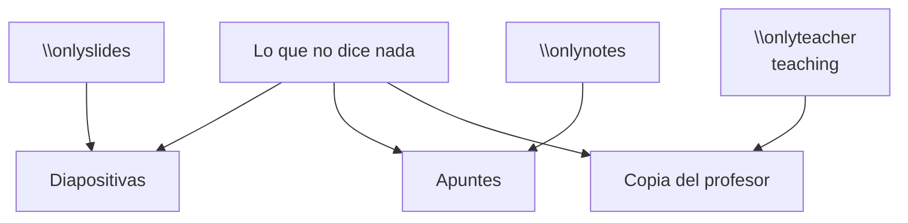

# Escribir contenido

Un fichero de unidad es LaTeX, con un vocabulario añadido que decide **a qué
salidas va cada trozo**. Esta página es lo esencial; la
[referencia completa](referencia.md) está al lado.

## El esqueleto

```latex
\begin{frame}
\didactatitle{Definición de espacio normado}

Todo lo que no diga nada sale en todas las salidas.

\onlyslides{Solo en las diapositivas.}
\onlynotes{Solo en los apuntes y en el libro.}
\onlyteacher{Solo en las copias del profesor.}
\end{frame}
```

`\begin{frame}` **no significa «diapositiva»**: es la unidad de contenido. Con
un perfil de diapositivas sale como una diapositiva; con uno de apuntes, como
un bloque de texto seguido.

`\didactatitle` es el título de la unidad, y sale donde cada medio lo espere:
como título de la diapositiva, o como encabezado de la sección.

### Material escrito como apuntes

Una hoja de problemas o una práctica se escriben primero como apuntes, con sus
apartados, y se ponen en diapositivas después. Para eso:

- `\slidetitle{…}` es el título de la diapositiva **y nada en los apuntes**,
  que ya tienen sus apartados: `\didactatitle` les llenaría el documento de
  encabezados que no estaban.
- Todo va dentro de un `frame` o de `notesonly`. Lo que queda fuera, en
  diapositivas, sale como una página sin forma que se sale por abajo.
- Lo que solo se quiere en los apuntes --los problemas propuestos del final,
  una demostración larga-- va en `notesonly`. **Un apartado que se queda sin
  ninguna diapositiva no sale en las diapositivas**: ni su portada ni su línea
  en el índice.
- Una caja que no cabe en una diapositiva no se parte sola: beamer la manda
  entera a la siguiente. Se escribe entera en `notesonly` y, en `slidesonly`,
  partida en dos; la continuación con el entorno con asterisco
  (`example*`, `exercise*`…), que no lleva número.
- `\paragraph{…}` también vale en diapositivas: el encabezado en negrita de un
  párrafo.

## Los tres canales




| Orden | Diapositivas | Apuntes | Profesor |
|---|:---:|:---:|:---:|
| *(nada)* | ✓ | ✓ | ✓ |
| `\onlyslides` | ✓ | | ✓ si el perfil es de diapositivas |
| `\onlynotes` | | ✓ | ✓ si el perfil es de documento |
| `\onlyteacher` | | | ✓ |

## Los teoremas

```latex
\begin{definition}[Espacio normado]
Un par $(E, \|\cdot\|)$ tal que\ldots
\end{definition}

\begin{theorem}[Hahn--Banach]
Toda forma lineal acotada en un subespacio se extiende\ldots
\end{theorem}

\begin{proof}
Por el lema de Zorn\ldots
\end{proof}
```

Hay `definition`, `theorem`, `proposition`, `lemma`, `corollary`, `example`,
`remark`, `question` y `proof`. Todos salen en una caja con el nombre y el
número --«Definición 1.2»-- en una etiqueta montada sobre el borde de arriba,
y el color dice de qué entorno se trata. Tiene **dos aspectos**: proyectada la
caja va con más contraste y una sombra corta, y en los apuntes con un tinte
muy suave, porque se lee durante una hora. La caja se parte entre páginas.

Los nombres --«Definición», «Definició», «Definition»-- los pone el idioma del
documento, no el fichero.

## Las pausas

```latex
La serie converge.
\pause
Y su suma es $\pi^2/6$.
```

`\pause` se respeta en `slides` y se ignora en `slides-flat` y en todos los
perfiles de documento.

## Las notas de clase

```latex
\begin{teaching}[Ritmo]
Quince minutos. Detente en la homogeneidad: es donde se atascan.
\end{teaching}
```

**Nunca sale en un documento del alumno**, en ningún perfil y por ningún
descuido, porque los perfiles del alumno no tienen ese canal.

## Los problemas

```latex
\begin{exercise}[Convergencia]
Estudia la convergencia de $\sum 1/n^2$.

\begin{hint}
Compárala con una integral.
\end{hint}

\begin{answer}
Converge; su suma es $\pi^2/6$.
\end{answer}

\begin{solution}
Por el criterio integral\ldots
\end{solution}

\begin{marking}
1 punto por plantear, 1 por calcular, 0{,}5 por concluir.
\end{marking}
\end{exercise}
```

[:octicons-arrow-right-24: Los cuatro niveles](../conceptos/problemas.md)

## Las figuras

Viven en `figures/`, dentro del directorio de la unidad, y se llaman desde
ahí:

```latex
\includegraphics[width=.6\textwidth,alt={La bola unidad: un círculo}]{figures/bola-unidad.pdf}
```

La ruta es la de la unidad, así que moverla o darla en otra asignatura no
rompe la figura. `alt={…}` es lo que se ve en ella, dicho para quien no la
ve: lo lee un lector de pantalla en los apuntes accesibles. En un dibujo va
igual, `\begin{tikzpicture}[alt={…}]`.
[:octicons-arrow-right-24: Apuntes accesibles](../app/compilar.md#apuntes-accesibles)

## La referencia completa

Todo lo demás --fórmulas destacadas, recuadros sin etiqueta, bibliografía,
alias heredados del sistema anterior, los detalles de cada entorno-- está en
la referencia:

[La referencia de escritura](referencia.md){ .md-button .md-button--primary }
