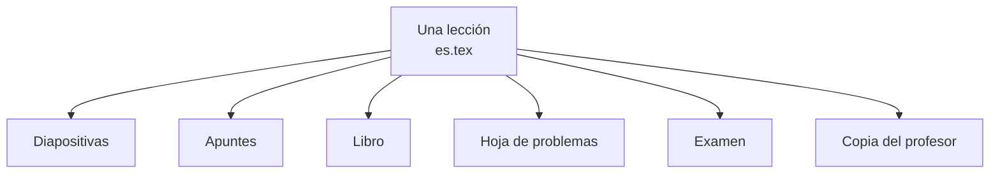

<div class="didacta-feature" markdown>
<div class="didacta-feature__text" markdown>

## Escribe una vez, reparte en todos los formatos

Una lección se escribe una sola vez. Lo que decide si sale en diapositivas, en
apuntes o en la copia del profesor no es el fichero: es el formato con el que
lo compilas.

El párrafo de `\onlynotes` solo aparece en los apuntes. La nota de ritmo, solo
en tu copia. Y todo eso en castellano, valenciano o inglés, según lo que la
lección tenga escrito.

[Las quince salidas](conceptos/perfiles.md){ .md-button }

</div>
<div markdown>

```latex
\begin{frame}
\didactatitle{Definición de espacio normado}

La métrica usual en $\mathbb{R}$ es $d(x,y) = |x-y|$.

\onlynotes{La idea es generalizar las
  propiedades útiles de esa distancia.}

\begin{definition}[Espacio normado]
Un par $(E, \|\cdot\|)$ tal que\ldots
\end{definition}

\begin{teaching}[Ritmo]
Quince minutos. Detente en la
homogeneidad.
\end{teaching}
\end{frame}
```

</div>
</div>

De ese fichero salen **quince documentos distintos**, sin tocar nada más:



<div class="didacta-feature" markdown>
<div class="didacta-feature__text" markdown>

## Encuentra cualquier cosa que hayas escrito

Todo el material de todos tus repositorios, junto y ordenado por materia. Tres
clics hasta cualquier lección, y cada nivel te dice cuánto hay y cuánto está
traducido.

Y en cuanto escribes, la lista se aplana y busca: «hilbert» no es un sitio del
árbol, es todo lo que lo menciona.

[La biblioteca](app/biblioteca.md){ .md-button }

</div>
<div markdown>


</div>
</div>

<div class="didacta-feature" markdown>
<div class="didacta-feature__text" markdown>

## Prepara el curso arrastrando

Un tema es una lista de lecciones en orden. Se reordena arrastrando, se añaden
desde la biblioteca, y lo que este año no das se queda comentado en lugar de
borrarse: el año que viene se vuelve a activar con un clic.

**Dar el mismo tema otro año es duplicar el curso.** Lo que corrijas una vez
sale corregido en todas partes, y el PDF del año pasado sigue como se dio.

[Asignaturas y cursos](app/asignaturas.md){ .md-button }

</div>
<div markdown>


</div>
</div>

<div class="didacta-feature" markdown>
<div class="didacta-feature__text" markdown>

## Compila y compara sin salir

Eliges versiones e idiomas, y los PDF se abren **dentro de la ventana**, uno al
lado del otro: las diapositivas junto a los apuntes, el castellano junto al
valenciano.

Mientras compila ves lo que LaTeX va escribiendo, y cuando algo falla te dice
el fichero y la línea.

[Compilar](app/compilar.md){ .md-button }

</div>
<div markdown>


</div>
</div>

<div class="didacta-feature" markdown>
<div class="didacta-feature__text" markdown>

## Traduce por donde importa

Lo que falta, ordenado **por cuántos documentos usan cada lección**: traducir
una que usan seis cursos te compra seis documentos.

Y lo que es peor que no estar traducido --una traducción cuyo original
cambió-- va primero, porque compila sin quejarse y dice algo que ya no es
cierto. Hay traducción automática para el primer borrador, que protege las
fórmulas y las órdenes de LaTeX antes de mandar nada.

[Traducción](app/traduccion.md){ .md-button }

</div>
<div markdown>


</div>
</div>

<div class="didacta-feature" markdown>
<div class="didacta-feature__text" markdown>

## Nada se pierde

Cada cambio queda con tu nombre y su mensaje, y puedes ver cómo estaba
cualquier fichero en cualquier momento, sin salir a un terminal.

Y como todo vive en repositorios de GitHub, **compartes lo que quieras
compartir**: la colección de problemas con el departamento, tus apuntes solo
contigo.

[El historial](app/historial.md){ .md-button }

</div>
<div markdown>


</div>
</div>

<div class="didacta-latest" markdown>
:material-clock-fast: **Se empieza en diez minutos.** Instalar, entrar en
GitHub y abrir el primer repositorio lo hace la propia aplicación la primera
vez que la abres.
</div>

## Descargar

--8<-- "descargas.md"

## Por dónde seguir

<div class="grid cards" markdown>

-   :material-rocket-launch-outline: __Nunca la he usado__

    ---

    Instalar, entrar en GitHub, abrir el primer repositorio y compilar algo.

    [:octicons-arrow-right-24: Empezar](empezar/index.md)

-   :material-application-outline: __Enséñame la aplicación__

    ---

    Pantalla por pantalla, con capturas: qué hace cada una y cómo se usa.

    [:octicons-arrow-right-24: La aplicación](app/index.md)

-   :material-lightbulb-on-outline: __¿Cómo funciona esto?__

    ---

    Microlecciones, las quince salidas, los idiomas y los repositorios.

    [:octicons-arrow-right-24: Cómo funciona](conceptos/index.md)

-   :material-pencil-ruler: __Quiero escribir contenido__

    ---

    Todo lo que se puede poner en una lección: teoremas, problemas, figuras,
    notas de clase.

    [:octicons-arrow-right-24: Escribir](escribir/index.md)

</div>
